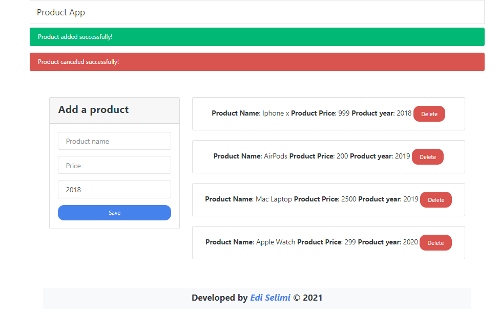

# Product App

> Product App created practicing JavaScript Object-Oriented, with 2 Classes.

## Live Demo

[Live Site](https://product-app-js.netlify.app/)

### View:

## Built With

- HTML
- CSS, Bootstrap, [Bootstwatch](https://bootswatch.com/)
- JavaScript

## Getting Started

Open index.html with your Browser.

## Author

👤 **Author**
- GitHub: [@Edi10-developer](https://github.com/Edi10-developer)
- LinkedIn: [LinkedIn](https://www.linkedin.com/in/edi-selimi-856671173/?locale=en_US)
- Portfolio: [www.ediselimi.com](https://ediselimi.com/)

## Show your support

Contributions, issues, and feature requests are welcome!
Give a ⭐️ if you like this project!

## Acknowledgments

- Hat tip to anyone whose code was used
- Inspiration
- etc

